<div align="center">
  <h1>💼 USES CRM & Analysis</h1>
  <p><strong>A multifunctional ERP/CRM system for salary accounting, production expenses, and smart AI analytics.</strong></p>

  <p>
    
    
    
    
  </p>
</div>

---

## 📋 Table of Contents
- [About the Project](#-about-the-project)
  - [What's New in the AI Version](#-whats-new-in-the-ai-version)
  - [Key Features](#-key-features)
  - [How Smart Analytics Works](#-how-smart-analytics-works-tool-agent--function-calling-)
- [Technology Stack](#-technology-stack)
- [Project Structure](#-project-structure)
- [Screenshots](#-screenshots-)
- [Installation and Launch (Local)](#-installation-and-launch-local)
- [Testing](#-testing)
- [Deployment (Production)](#-deployment-production)
- [Contributing](#-contributing)
- [Contacts](#-contacts)
- [License](#-license)

---

## 📖 About the Project

**USES** is a full-featured web application designed for businesses that need automated financial accounting. The app integrates with external CRM systems to sync deals and managers, manages production expenses, and provides a powerful OpenAI (ChatGPT)-based AI analytics tool for financial analysis.

### 🎯 Who It Is For and What Problem It Solves

**Who it is for:** companies with a sales department and regular employee payouts (commissions/bonuses), where transparent salary calculations and expense control are essential.

**Pain points it solves:** manual spreadsheets and “scattered numbers” -> payroll miscalculations, wasted time, and difficulty quickly explaining final totals and reasons for deviations.

### ✅ Key Business Benefits

- **Transparency:** clear visibility into how payroll accruals/payouts and expenses are formed.
- **Speed:** fast period-based reporting without manual reconciliation.
- **Control:** a single source of truth for expenses and salaries.
- **Reporting readiness:** export salary and expense data to Excel for accounting.

### 🆕 What's New in the AI Version

- **New analytics engine:** migrated from executable code generation to a controlled `tool calling` agent loop.
- **Fact-based data answers:** the model first calls server-side functions, then builds conclusions from returned figures.
- **Multi-step queries:** AI can perform several sequential tool calls in one request (e.g., comparing sales + expenses + payouts).
- **Better access control:** analytics works strictly within active UI filters and user permissions.
- **More stable in production:** reduced risk from arbitrary code execution and more predictable behavior for business reports.

### ✨ Key Features

- 🔄 **External CRM integration:** receive managers, companies, and new deals via a secure Webhook API.
- ⏱️ **Reliable import with progress:** protected from parallel runs, step-by-step progress/ETA, and retry logic for temporary CRM API network errors.
- 💰 **Salary and payout accounting:** automatic salary calculations based on closed deals with actual payout tracking.
- 🏭 **Production expenses:** monitor company spending, split expenses by type and responsible employees.
- 📊 **Excel export:** save salary and expense data to Excel for reporting and accounting handoff.
- 🤖 **Smart AI Analytics:** tool-calling AI assistant with multi-step queries, streaming responses, chat history, and saved tabular results.
- 🛡️ **Permission system:** authorization and role-based access to admin and analytics tools.
- 🧾 **Operational UX features:** print payout/expense confirmations and quickly calculate manager payout balances.
- 🌐 **Interface language:** switch RU / UK / EN in UI (Django i18n).
- 🌓 **Theme support:** light and dark themes; choice is persisted in browser (`localStorage`).

### 🧠 How Smart Analytics Works (Tool Agent / Function Calling) <a name="ai-analytics"></a>

**In plain terms:** you ask a natural-language question ("why did sales drop?", "how much was paid by month?", "who is the top deal performer?"), and the system selects the required DB analytics queries, builds a table, and generates conclusions - without manual SQL/Excel work.

The current version uses an **agent loop based on Function Calling** (without generating and `exec()`-ing arbitrary Python code). In other words, it is an "AI analyst with a safe set of tools," not an interpreter for arbitrary scripts:

1. **Request + context:** the user sends a question. The app passes context to the model (chat history, active dashboard filters, question language RU/UK/EN).
2. **Server tool calls:** the model calls strictly defined functions:
   - `crm_analytics_aggregate` - aggregates (sum, count, average, max) for sales/expenses/payouts;
   - `crm_analytics_list` - detailed record rows;
   - `crm_analytics_compare_months` - month comparison and top deals.
3. **Safe execution:** tools run only on pre-filtered querysets (respecting UI permissions and period), without access to system operations or data modification.
4. **Multi-step agent loop:** if data is insufficient, the model makes additional tool calls (multiple rounds), then builds one consolidated fact-based response.
5. **UI result:** the user receives text analysis + tabular data; the response is saved in AI analytics history for later review.
6. **Visualization:** when tabular output exists, the UI can automatically build charts for faster trend reading.

#### 🔒 AI Analytics Security

- A limited set of server-side functions (Function Calling) is used instead of arbitrary user code execution.
- All data selections stay within user-accessible querysets and active UI filters.
- The analytics layer is designed as **read-only** for business data (no record modifications via AI tools).
- Detailed hardening and production security recommendations are in **[SECURITY.md](SECURITY.md)**.

---

## 🛠 Technology Stack

- **Backend:** Python 3.10+, Django 5.x
- **Database:** MySQL (production-ready)
- **AI Integration:** OpenAI-compatible API + tool calling (agent loop); support for GPT-4o / GPT-OSS class models via compatible endpoint
- **Frontend:** HTML5, Bootstrap 5, Vanilla JS, custom animations, and interactive charts.
- **Server (Production):** Gunicorn + WhiteNoise for static files.

Recommendations for secrets, HTTPS, and hardening are in **[SECURITY.md](SECURITY.md)**.

---

## 🗂 Project Structure

```text
├── salary_app/              # Main Django application
│   ├── ai_views.py          # AI flow: tool calling, chat history, SSE responses
│   ├── ai_tools.py          # Server analytics functions crm_analytics_*
│   ├── llm_service.py       # OpenAI-compatible API integration and agent loop
│   ├── views/               # View handlers
│   ├── models/              # Database models
│   ├── templates/           # HTML templates
│   └── static/              # JS scripts, CSS, and static assets
├── salary/                  # Django project settings (settings.py, urls.py)
├── requirements.txt         # Python dependencies
├── .env.example             # Example environment variables file
└── manage.py                # Django management utility
```

---

## 📸 Screenshots <a name="screenshots"></a>
Below are several real screens from the application.

| Login | Dashboard (totals) | Dashboard (chart) |
| :---: | :---: | :---: |
| 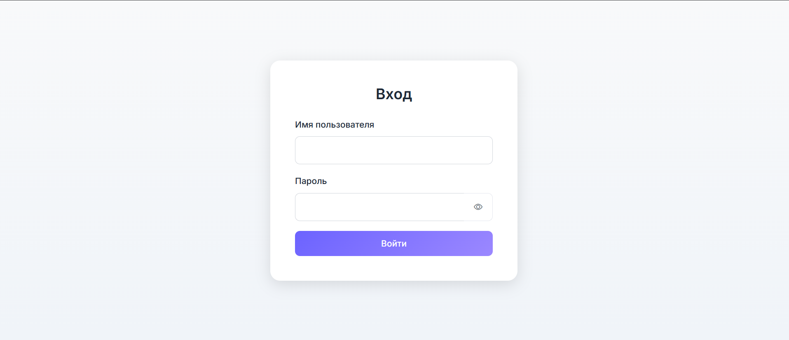 | 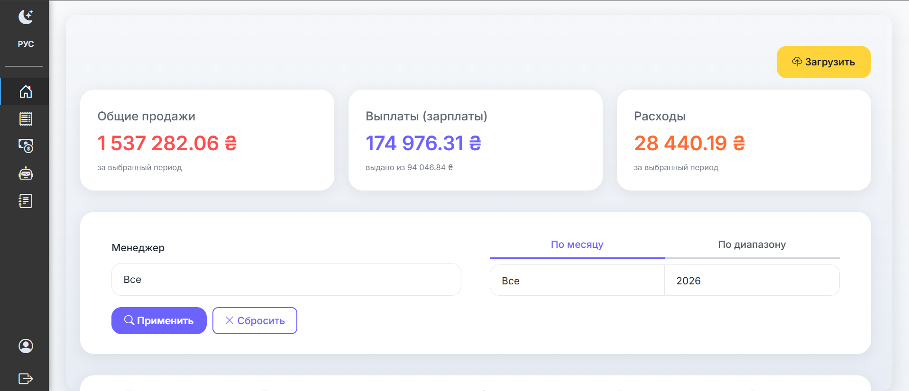 | 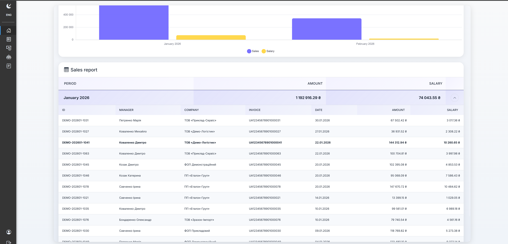 |

| Salary report (dark theme) | Expense list (dark theme) | Expense editing |
| :---: | :---: | :---: |
| 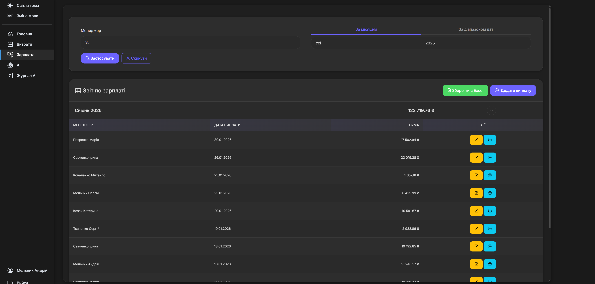 | 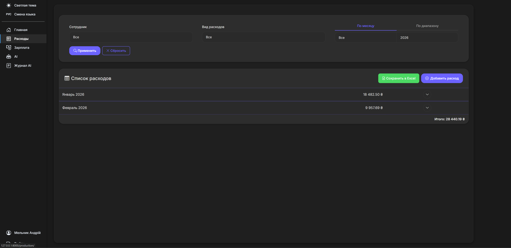 | 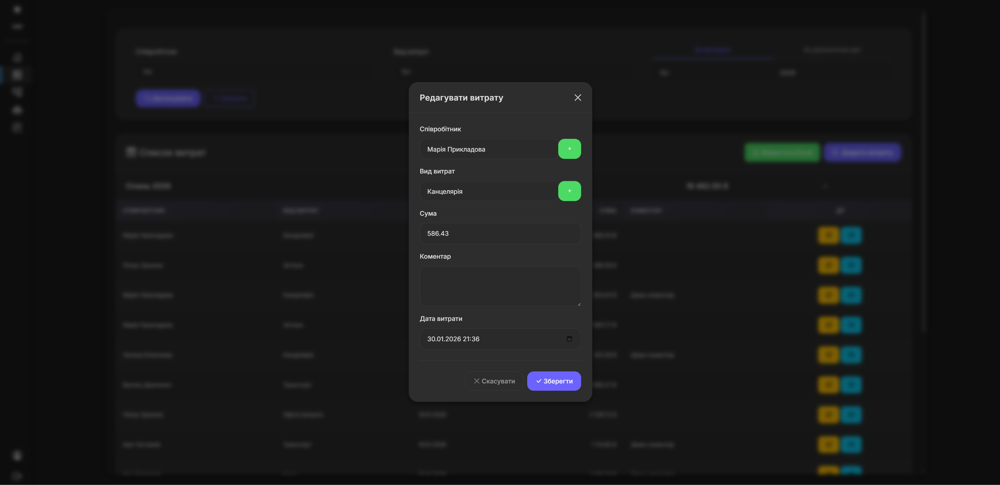 |

| AI chat (dark theme) | AI analytics table | AI / execution log |
| :---: | :---: | :---: |
| 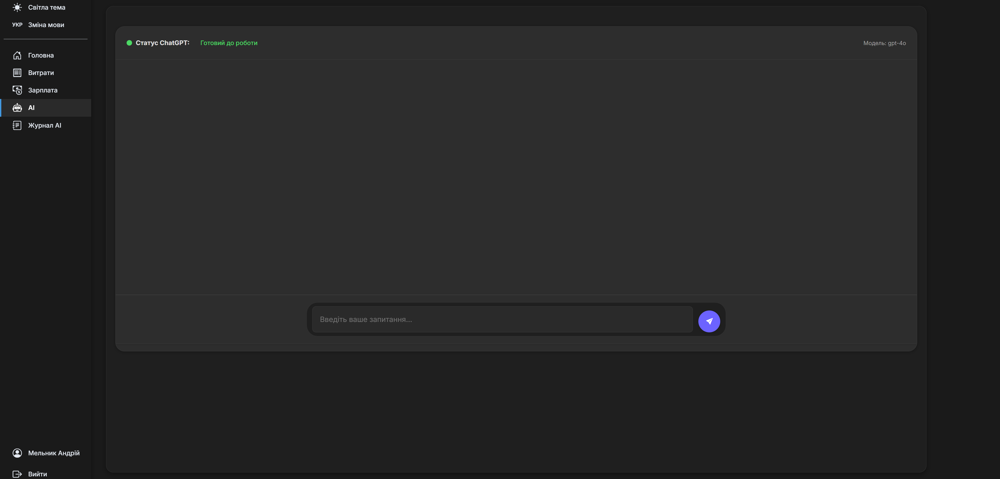 | 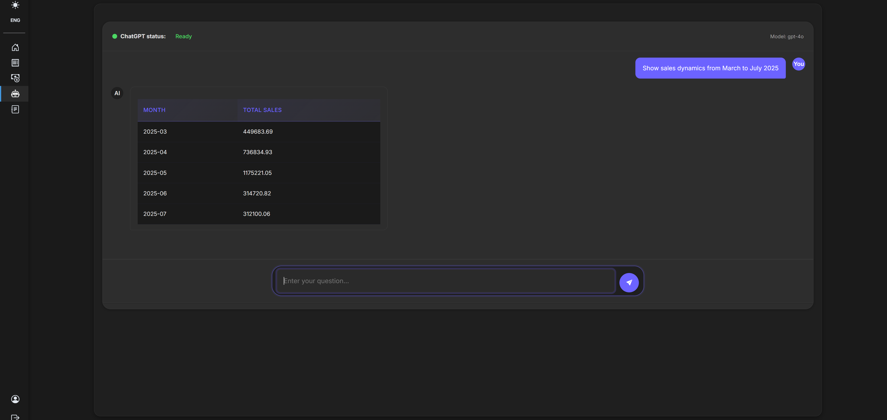 | 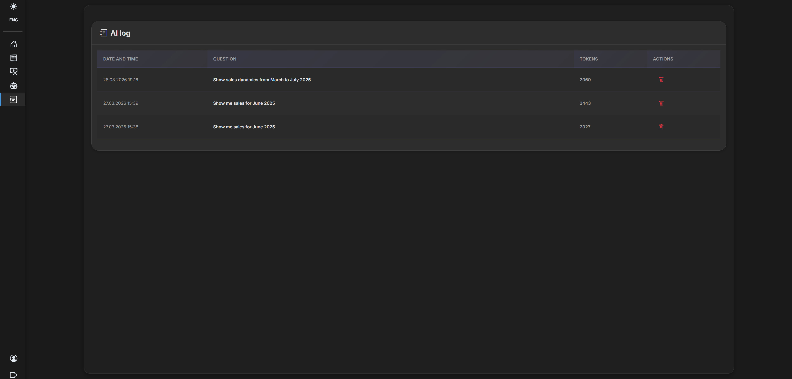 |

| Users | Expenses (expanded view) | Print payout confirmation |
| :---: | :---: | :---: |
| 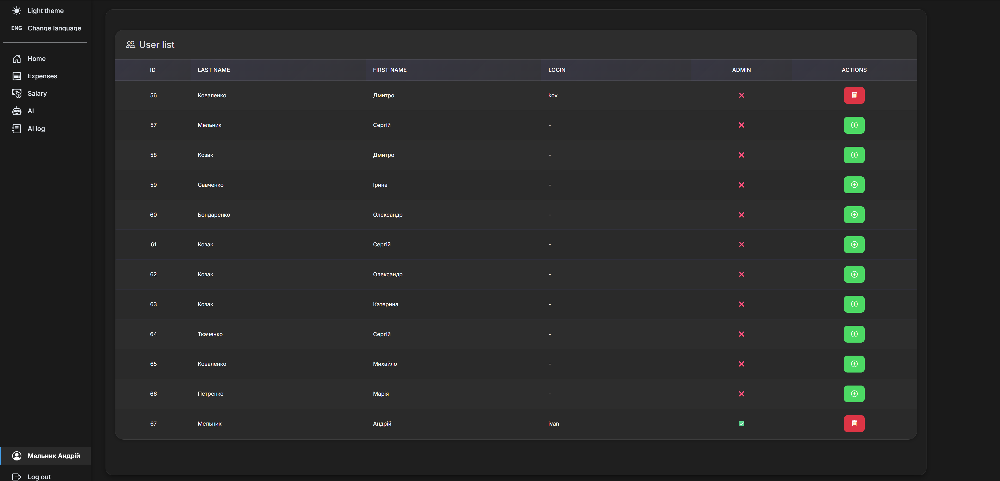 | 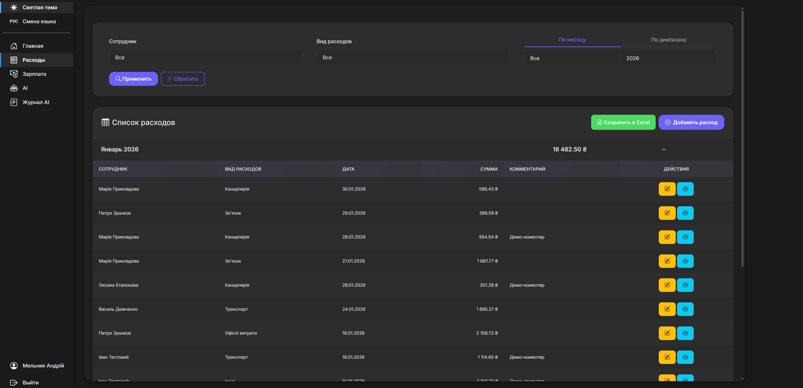 | 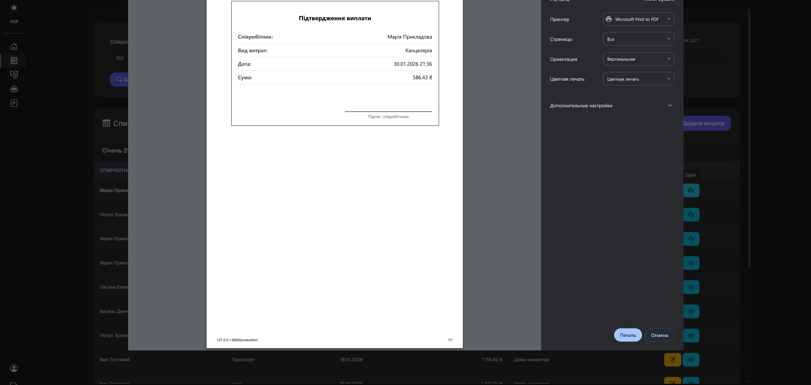 |

### 📝 Screen Descriptions

- **Login:** system sign-in and initial checkpoint for access/role verification.
- **Dashboard (totals):** key period summary metrics in one place.
- **Dashboard (chart):** visual trend chart of performance indicators (revenue/costs, etc.).
- **Salary report (dark theme):** accrual/payout summary for employees in dark mode.
- **Expense list (dark theme):** expense journal with filters and quick preview in dark mode.
- **Expense editing:** modal window for creating/editing an expense record.
- **AI chat (dark theme):** conversation with AI assistant for data questions in dark mode.
- **AI analytics table:** tabular result of calculations/metrics prepared by AI for the request.
- **AI / execution log:** technical execution/analysis log for transparency and debugging.
- **Users:** user list and account management.
- **Expenses (expanded view):** expanded expense list display (more details per row).
- **Print payout confirmation:** printable payout confirmation/receipt form.

---

## 🚀 Installation and Launch (Local)

### 1. Clone the Repository
```bash
# Replace YOUR_USERNAME with the actual user or organization name
git clone https://github.com/Mch-in/USES.git
cd USES
```

### 2. Set Up a Virtual Environment
```bash
python -m venv venv

# Activate environment (Windows)
venv\Scripts\activate

# Activate environment (macOS/Linux)
source venv/bin/activate
```

### 3. Install Dependencies
```bash
pip install -r requirements.txt
```

### 4. Configure Environment Variables
Copy the sample configuration file and fill it in:
```bash
# macOS/Linux/Windows(Git Bash)
cp .env.example .env

# Windows(CMD)
copy .env.example .env
```

| Variable | Description | Required |
| ---------- | :--- | :---: |
| `SECRET_KEY` | Django secret key | ✅ |
| `DEBUG` | Enable debug mode (`True` / `False`) | ✅ |
| `CRM_WEBHOOK_BASE` | Valid CRM24 webhook URL for synchronization | ✅ |
| `OPENAI_API_KEY` | OpenAI API access token for AI analytics | ❌ |
| `DB_USER`, `DB_PASSWORD`... | MySQL connection parameters (if MySQL is used) | ❌ |

### 5. Run DB Migrations and Create a Superuser
```bash
python manage.py migrate
python manage.py createsuperuser
```

### 6. Start the Server
```bash
python manage.py runserver
```

The application will be available at: **http://127.0.0.1:8000/**

---

## 🧪 Testing

To run application unit tests, execute:
```bash
python manage.py test
```

---

## 📦 Deployment (Production)

For production (`DEBUG=False`), static assets must be built (using `django-compressor` with offline compression).

1. Ensure services are configured (Gunicorn/Docker/Nginx, etc.).
2. Collect and compress static assets:
```bash
python manage.py collectstatic --noinput
python manage.py compress --force
```

*(Running in isolated Docker containers is recommended.)*

---

## 🤝 Contributing

If you want to support project development:
1. Fork the repository.
2. Create a new branch (`git checkout -b feature/amazing-feature`).
3. Commit your changes (`git commit -m 'Add amazing feature'`).
4. Push the branch (`git push origin feature/amazing-feature`).
5. Open a Pull Request.

---

## ✉️ Contacts

**Author:** [Your Name / Nickname]  
**Email:** your.email@example.com  
**Telegram:** [@your_telegram](https://t.me/your_telegram)  
**GitHub:** [github.com/YOUR_USERNAME](https://github.com/YOUR_USERNAME)

**Need a demo or pilot?** Write in Telegram/Email - I will show real "salary/expenses/analytics" scenarios and help you deploy the project quickly.

If you have ideas to improve the project or found a bug, please open an **Issue** in this repository!

---

## 📄 License

This project is distributed under the MIT License. The license text is available in [`LICENSE`](LICENSE) in the repository root.
